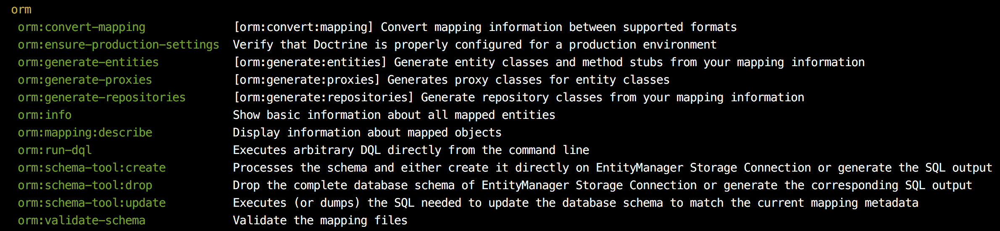

# Nettrine / ORM

## Content

- [Minimal configuration](#minimal-configuration)
- [ORM extension](#ormextension)
	- [EntityManagerDecorator](#entitymanagerdecorator)
	- [Configuration](#configuration)
		- [DoctrineExtensions](#doctrineextensions)
- [Bridges](#bridges)
	- [Annotations Bridge](#annotations-bridge)
	- [Cache Bridge](#cache-bridge)
	- [Console Bridge](#console-bridge)
- [Other features](#other-features)
	- [ID attribute](#id-attribute)

## Minimal configuration

At first, you will need the Doctrine DBAL extension. Take a look at [Nettrine DBAL](https://github.com/nettrine/dbal) in this organization. Install `nettrine/dbal` package using composer.

```
composer require nettrine/dbal
```

Place `DbalExtension` in your neon config file.

```yaml
extensions:
    dbal: Nettrine\DBAL\DI\DbalExtension
```

And set-up DBAL connection.

```yaml
dbal:
    connection:
        host: 127.0.0.1
        user: root
        password:
        dbname: nettrine
        #driver: pdo_pgsql
```

Secondly, enable the Doctrine ORM extension. It's provided by this package.

```yaml
extensions:
    orm: Nettrine\ORM\DI\OrmExtension
```

Pick any metadata provider, for example **annotations** (they are widely used). We have a special extension for annotations (`Nettrine\ORM\DI\OrmAnnotationsExtension`).

```yaml
extensions:
    orm.annotations: Nettrine\ORM\DI\OrmAnnotationsExtension

orm.annotations:
    paths:
        - App/Model/Database/Entity
```

You can find more examples in our [playground](https://github.com/nettrine/playground) repository.

## OrmExtension

OrmExtension has a few options you can configure. Let's take a look at them.

### EntityManagerDecorator

Defining your own EntityManagerDecorator is useful for adding or overriding methods you need.

```yaml
orm:
    entityManagerDecoratorClass: App\Model\Database\EntityManagerDecorator
```

```php
namespace App\Model\Database;

use Nettrine\ORM\EntityManagerDecorator as NettrineEntityManagerDecorator;

class EntityManagerDecorator extends NettrineEntityManagerDecorator
{

}

```

### Configuration

List of all configuration options:

```yaml
orm:
    configuration:
        proxyDir: '%tempDir%/proxies'
        autoGenerateProxyClasses: NULL
        proxyNamespace: 'Nettrine\Proxy'
        metadataDriverImpl: NULL
        entityNamespaces: []
        customStringFunctions: []
        customNumericFunctions: []
        customDatetimeFunctions: []
        customHydrationModes: []
        classMetadataFactoryName: NULL
        defaultRepositoryClassName: NULL
        namingStrategy: Doctrine\ORM\Mapping\UnderscoreNamingStrategy
        quoteStrategy: NULL
        entityListenerResolver: NULL
        repositoryFactory: NULL
        defaultQueryHints: []
```

#### DoctrineExtensions

```yaml
orm:
    configuration:
        customDatetimeFunctions:
            ...
            year: DoctrineExtensions\Query\Mysql\Year
            ...
```


At this time we support only 1 connection, the **default** connection. If you need more connections (more databases?), please open an issue or send a PR. Thanks. 

## Bridges

The compiler extensions would be so big that we decided to split them into more separate files / compiler extensions. 

### Annotations Bridge

Are you using annotations in your entities?

```php
/**
 * @ORM\Entity
 */
class Category
{
```

You will need the `OrmAnnotationsExtension`. This is the default configuration, it uses the `filesystem` cache driver.

```yaml
extensions:
    orm: Nettrine\ORM\DI\OrmExtension
    orm.annotations: Nettrine\ORM\DI\OrmAnnotationsExtension

orm.annotations:
    paths: []
    excludePaths: []
    ignore: []
    defaultCache: filesystem
```

Available drivers: 

- `apc` - `ApcCache`
- `apcu` - `ApcuCache`
- `array` - `ArrayCache`
- `filesystem` - `FilesystemCache`
- `memcache` - `MemcacheCache`
- `memcached` - `MemcachedCache`
- `redis` - `RedisCache`
- `void` - `VoidCache`
- `xcache` - `XcacheCache`

You can change cache settings for the annotation reader.

```yaml
orm.annotations: 
    defaultCache: apcu

    # or directly
    cache: @cacheReader
```

### Cache Bridge

This extension sets up cache for all important parts: `queryCache`, `resultCache`, `hydrationCache`, `metadataCache` and `secondLevelCache`.

This is the default configuration, it uses the `filesystem` driver.

```yaml
extensions:
    orm: Nettrine\ORM\DI\OrmExtension
    orm.cache: Nettrine\ORM\DI\OrmCacheExtension

orm.cache:
    defaultDriver: filesystem
```

Available drivers: 

- `apc` - `ApcCache`
- `apcu` - `ApcuCache`
- `array` - `ArrayCache`
- `filesystem` - `FilesystemCache`
- `memcache` - `MemcacheCache`
- `memcached` - `MemcachedCache`
- `redis` - `RedisCache`
- `void` - `VoidCache`
- `xcache` - `XcacheCache`

You can also specify a single driver. Or change the `orm.cache.defaultDriver` for all of them.

```yaml
orm.cache:
    queryCache: App\SpecialDriver
    resultCache: App\SpecialOtherDriver
    hydrationCache: App\SpecialDriver('foo')
    metadataCache: @cacheDriver
    secondLevelCache: @cacheDriverFactory::create('bar')
```

### Console Bridge

This package works well with [Symfony/Console](https://symfony.com/doc/current/components/console.html). Take a look at [contributte/console](https://github.com/contributte/console) tiny integration for Nette Framework.

```yaml
extensions:
    # Console
    console: Contributte\Console\DI\ConsoleExtension

    # Orm
    orm: Nettrine\ORM\DI\OrmExtension
    orm.console: Nettrine\ORM\DI\OrmConsoleExtension
```

Since this moment you can use all registered Doctrine ORM commands using `bin/console`.



## Other features 

### Id attribute

You can use the predefined `Id` trait in your Entities.

```php

use Nettrine\ORM\Entity\Attributes\Id;

/**
 * @ORM\Entity
 */
class Category
{

    use Id;

}
```

### Entity Mapping

You can use the predefined `TEntityMapping` trait in your extensions.

```php

use Nette\DI\CompilerExtension;
use Nettrine\ORM\DI\TEntityMapping;

class CategoryExtension extends CompilerExtension
{

    use TEntityMapping;

    public function loadConfiguration(): void
    {
        $this->setEntityMappings([
            'Forum' => __DIR__ . '/../Entity',
        ]);
    }
}
```
